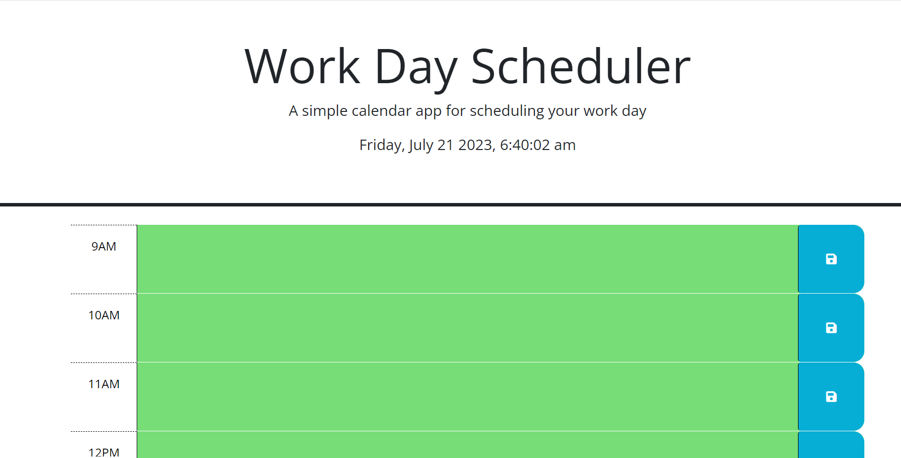
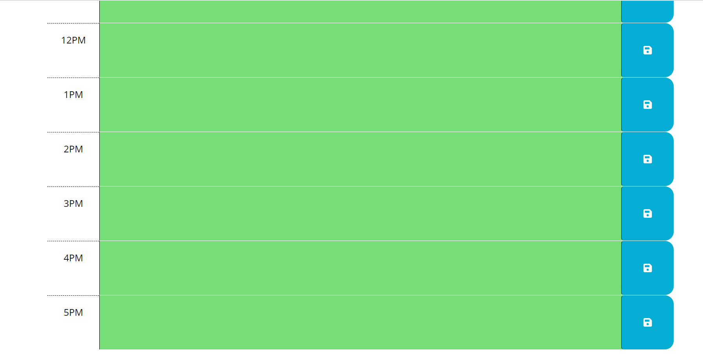
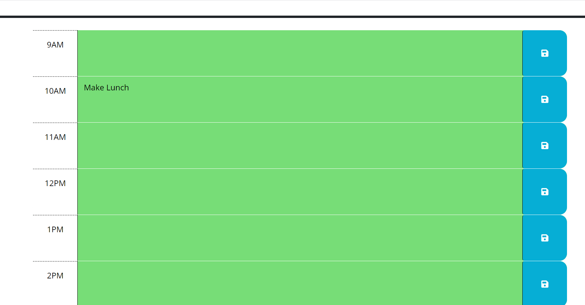
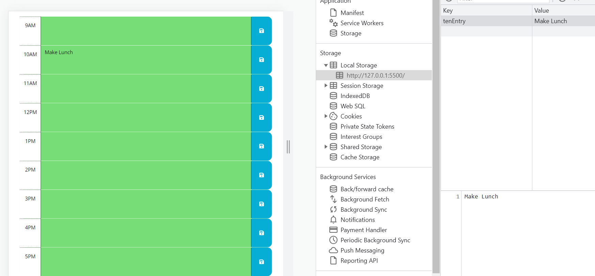

# 05-Work-Day-Scheduler
The challenge assignment for the Third-Party APIs module

# Challenge-05 Third-Party APIs: Work Day Scheduler

## Description
The purpose of this project is to modify starter code to create a simple calendar application that allows a user to save events for each hour of a typical working day (9AM to 5PM). The app will run in the browser and feature dynamically updated HTML and CSS powered by jQuery. Acceptance Criteria have been broken down into indidivual features (e.g. AC01). For details on the implementation, review the applicable 'Usage' section of this README.

### User Story

* AS AN employee with a busy schedule
I WANT to add important events to a daily planner
SO THAT I can manage my time effectively

### Acceptance Criteria

> * GIVEN I am using a daily planner to create a schedule
> * AC01: Current Day
>    -	WHEN I open the planner
>    -	THEN the current day is displayed at the top of the calendar    

>* AC02: Calendar Layout
>    -	WHEN I scroll down
>    -	THEN I am presented with timeblocks for standard business hours of 9am&ndash;5pm

>* AC03: Color-Coding
>    -	WHEN I view the timeblocks for that day
>    -	THEN each timeblock is color coded to indicate whether it is in the past, present, or future

>* AC04: Timeblock User Entry
>    -	WHEN I click into a timeblock
>    -	THEN I can enter an event

>* AC05: Save User Entries
>    -	WHEN I click the save button for that timeblock
>    -	THEN the text for that event is saved in local storage

>* AC06: Persistent Events
>    -	WHEN I refresh the page
>    -	THEN the saved events persist

## Installation

> * To launch the webpage, open the browser and paste the following URL in the address bar: https://recenasu.github.io/05-Work-Day-Scheduler/
> * To access the project repo, open the browser and paste the following URL in the address bar: https://github.com/recenasu/05-Work-Day-Scheduler

## Usage

> * Launch the webpage and view the current data and time displayed at the top of the page (AC01). Scroll down to view the individual hourly time blocks for the day from 9AM to 5PM (AC02). Note that the blocks are color-coded green (for future time), red (for present time), and gray (for past time) (AC03).

> * Click in a time block and type text to add an event (AC04). Click the Save button for that time block (AC05). Click refresh in the browser to reload the web page. The entered event is still visible (AC06).

The following images show the application sequence.

## Credits

N/A

## License

N/A

## Tests

>1. Open Google Chrome and navigate to https://recenasu.github.io/05-Work-Day-Scheduler/
>2. View the data/time at the top of the page.
>3. Scroll down to view time blocks.
>4. Confirm time blocks are color-coded red (present hour), green (future hour), and gray (past hour).
>5. Click in a time block. 
>6. Type custom text.
>7. Click the Save button for that time block.
>8. Right click on the web page and select Inspect.
>9. Select the Application tab > Storage > Local Storage > and highlight the local resource IP address. 
>10. Confirm that the custom text appears in local storage key-value pairs.
>11. Refresh the webpage to confirm the entries persist. 

